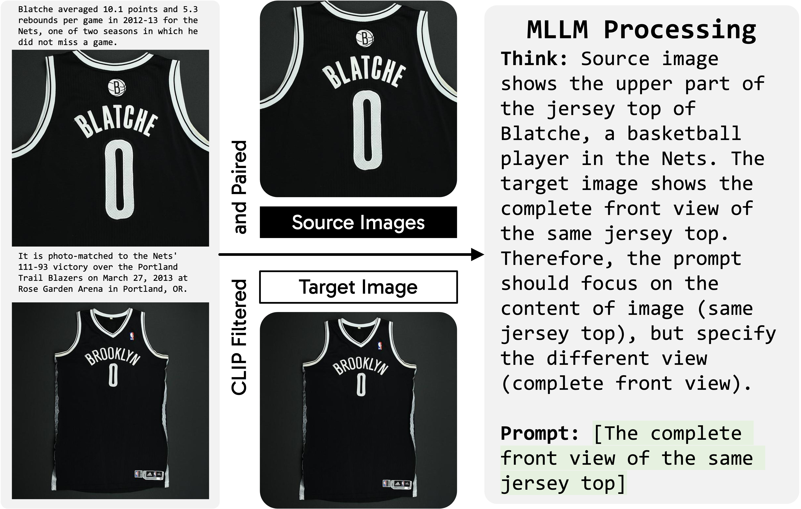
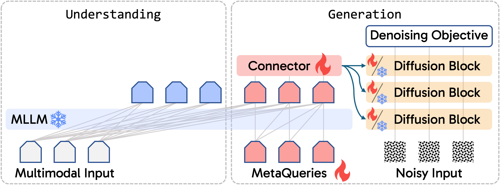
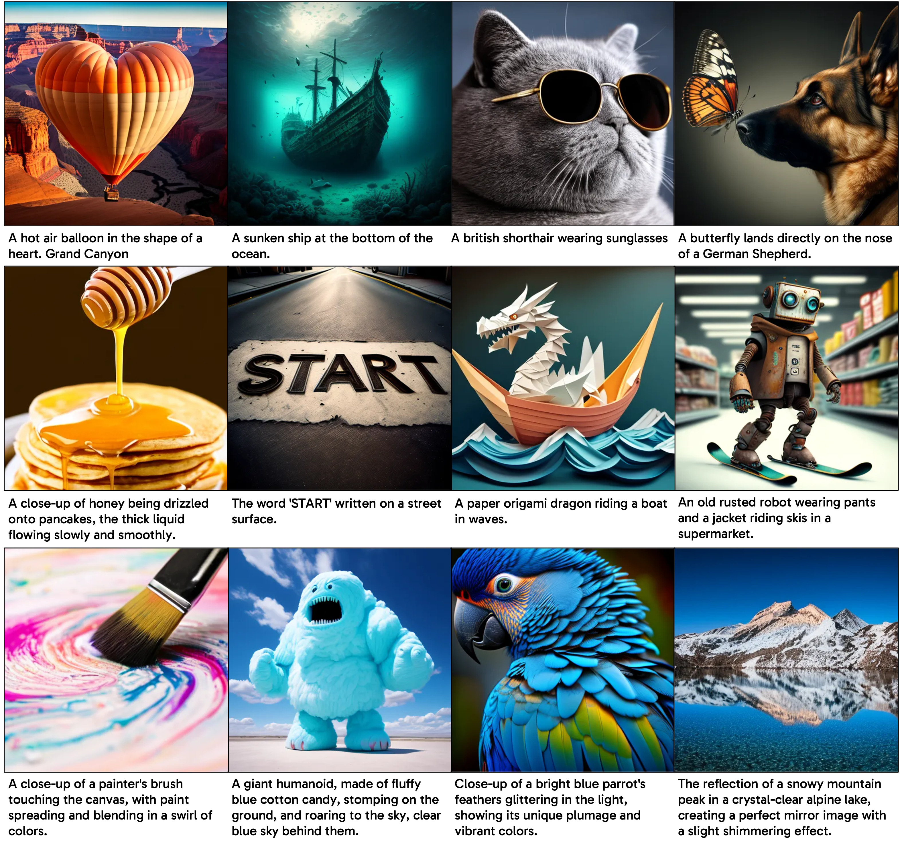

# Transfer between Modalities with MetaQueries

<p align="center">
    
</p>

<a href="https://arxiv.org/abs/2504.06256" target="_blank">
    
</a>
<a href="https://xichenpan.com/metaquery" target="_blank">
    
</a>
<a href="https://huggingface.co/collections/xcpan/metaquery-instruction-tuning-data-685b0f16d81ce54bcb7ea3a8" target="_blank">
    
</a>

[Xichen Pan](https://xichenpan.com/) &emsp;
[Satya Narayan Shukla](https://satyanshukla.github.io/)<sup>†</sup> &emsp;
[Aashu Singh](https://www.linkedin.com/in/aashu-singh-030ab646/) &emsp;
[Zhuokai Zhao](https://zhuokai-zhao.com/) &emsp;
[Shlok Kumar Mishra](https://shlokk.github.io/shlokmishra.github.io/) &emsp;
[Jialiang Wang](https://sites.google.com/view/jialiangwang/home) &emsp;
[Zhiyang Xu](https://scholar.google.com/citations?user=Qcshi8UAAAAJ&hl=en) &emsp;
[Jiuhai Chen](https://scholar.google.com/citations?user=eJP77eoAAAAJ&hl=en) &emsp;
[Kunpeng Li](https://kunpengli1994.github.io/) &emsp;
[Felix Juefei-Xu](https://xujuefei.com/) &emsp;
[Ji Hou](https://sekunde.github.io)<sup>†</sup> &emsp;
[Saining Xie](https://www.sainingxie.com/)<sup>†</sup>


## Installation
```bash
conda env create -f environment.yml
conda activate metaquery
```

## Training
If you want to train the model on a single node, you can use the following command.
- `run_name` is the name that appears in the checkpoint path and wandb.
- `config_file` is the path to the yaml file that contains the training configs. You can find the provided configs [here](configs). If you want to specify the configs directly in the command line, you can also skip the `--config_file` argument.
- `base_dir` is the path to the directory where you wish to save data and checkpoints.

```bash
OMP_NUM_THREADS=12 torchrun --nproc-per-node=8 train.py \
    --run_name test \
    --config_file llavaov0p5_sana.yaml \
    --base_dir /path/to/metaquery
```

> **Tips**: To speed up the data downloading, you can try to run the following command first to download the data in parallel (e.g., 64 threads), then switch to the regular training command above.
>
> ```bash
> OMP_NUM_THREADS=64 torchrun --nproc-per-node=1 train.py \
>     --run_name test \
>     --config_file llavaov0p5_sana.yaml \
>     --base_dir /path/to/metaquery
> ```

> **Note**: For text-to-image pretraining, we only provide the code for [cc12m](https://huggingface.co/datasets/pixparse/cc12m-wds) since it can be loaded directly with the [datasets](https://github.com/huggingface/datasets) package. Using this dataset alone cannot guarantee the same performance as reported in the paper. For other datasets, you will need to modify the code to support them. For example, users can try to load [BLIP3o dataset](https://huggingface.co/BLIP3o) for better performance.

If you wish to train the model on multiple nodes, we also provide a sample SLURM script [here](run_slurm.sh) for reference.

For the edit and instruction tuning training, you may need to also specify the `--resume_from_checkpoint` argument to resume from the previous checkpoint.

## Demo
When you have the checkpoint ready, you can run the following command to start the demo:
```bash
python app.py --checkpoint_path /path/to/checkpoint
```

## Evaluation
For evaluation, please follow the instructions [here](eval/EVALUATION.md).

## MetaQuery Instruction Tuning Data (2.4M)

<p align="center">
    
</p>

In this work, we collect an instruction tuning dataset [MetaQuery-Instruct-2.4M](https://huggingface.co/collections/xcpan/metaquery-instruction-tuning-data-685b0f16d81ce54bcb7ea3a8). We group images from web corpora based on caption similarity, then construct instruction-tuning data from these image pairs using an MLLM.

We provide the dataset curation code [here](curate_dataset.py) for reference. The dataset is curated from [mmc4](https://huggingface.co/datasets/mmc4).

After tuning on the MetaQuery-Instruct-2.4M dataset, the model achieves impressive zero-shot subject-driven generation performance (the first row) and surprisingly unlocks novel capabilities like visual association and logo design that go beyond copy-pasting (the second row).

<p align="center">
    
</p>

## Results

<p align="center">
    
</p>

With a frozen MLLM and flexible MetaQueries, we can train State-of-the-Art unified multimodal understanding and generation models as easy as fine-tuning a diffusion model.

| Methods | Base (M)LLM | MME-P | MMB | SEED | MMMU | MM-Vet | COCO FID ↓ | MJHQ FID ↓ | GenEval ↑ | DPG-Bench ↑ |
|---------|-------------|--------|-----|------|-------|---------|------------|------------|------------|--------------|
| Show-o-512 | Phi-1.5 1.3B | 1097.2 | - | - | 26.7 | - | 9.24 | 15.18 | 0.68 | - |
| Emu3 | From Scratch 7B | - | 58.5 | 68.2 | 31.6 | 37.2 | 12.80 | - | 0.66† | 80.60 |
| MetaMorph | LLaMA-3 8B | - | 75.2 | 71.8 | - | - | 11.8 | - | - | - |
| Transfusion | From Scratch 7B | - | - | - | - | - | 8.70 | - | 0.63 | - |
| LMFusion | LLaVA-Next 8B | 1603.7 | 72.1 | 72.5 | 41.7 | - | **8.20** | - | - | - |
| Janus-Pro-1B | DeepSeek-LLM 1.5B | 1444.0 | 75.5 | 68.3 | 36.3 | 39.8 | - | 14.33‡ | 0.73 | 82.63 |
| Janus-Pro-7B | DeepSeek-LLM 7B | 1567.1 | 79.2 | 72.1 | 41.0 | 50.0 | - | 13.48‡ | **0.80** | **84.19** |
| MetaQuery-B | LLaVA-ov 0.5B | 1238.0 | 58.5 | 66.6 | 31.4 | 29.1 | 8.91 | 6.28 | 0.74† | 80.04 |
| MetaQuery-L | Qwen2.5-VL 3B | 1574.3 | 78.6 | 73.8 | 53.1 | 63.2 | 8.87 | 6.35 | 0.78† | 81.10 |
| MetaQuery-XL | Qwen2.5-VL 7B | **1685.2** | **83.5** | **76.9** | **58.6** | **66.6** | 8.69 | **6.02** | 0.80† | 82.05 |

† denotes rewritten prompts. ‡ denotes results tested by us under the same settings. We report the COCO FID with frozen Stable Diffusion v1.5, and other metrics with fine-tuned Sana 1.6B. Best results are shown in **bold**.

<p align="center">
    
</p>

## License

The data is licensed [CC-by-NC](LICENSE). Third party content pulled from other locations are subject to their own licenses and you may have other legal obligations or restrictions that govern your use of that content.

The MetaQuery dataset is also released under [ODC-BY](https://opendatacommons.org/licenses/by/1-0/) and [Common Crawl terms of use](https://commoncrawl.org/terms-of-use/), because it is sourced from [mmc4](https://github.com/allenai/mmc4/tree/main).


## Citation
If you find MetaQuery useful for your research and applications, please cite using this BibTeX:

```bibtex
@article{pan2025transfer,
  title={Transfer between modalities with metaqueries},
  author={Pan, Xichen and Shukla, Satya Narayan and Singh, Aashu and Zhao, Zhuokai and Mishra, Shlok Kumar and Wang, Jialiang and Xu, Zhiyang and Chen, Jiuhai and Li, Kunpeng and Juefei-Xu, Felix and Hou, Ji and Xie, Saining},
  journal={arXiv preprint arXiv:2504.06256},
  year={2025}
}
```
